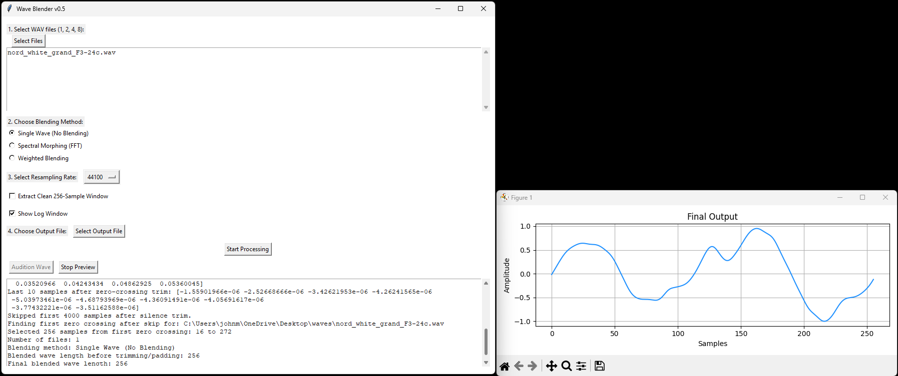

# wave_blender

**wave_blender** is a tool for importing, blending, and exporting `.wav` files into 16-bit PCM files, optimized for use with UDO synthesizers and any other hardware or software that supports 256 sample waveforms.

## Features

- **Wave Import:** Load 1, 2, 4, or 8 `.wav` files simultaneously.
- **Wave Blending:** Symmetrically consolidate multiple waves using advanced blending and Fourier transform algorithms.
- **Auditioning:** Preview and audition your blended waves before export.
- **Export:** Output ready-to-use 16-bit PCM files with exactly 256 samples, compatible with UDO synthesizers and similar devices.

## Wave File Requirements

- **Length:** Each imported WAV file must be **at least 5 seconds long**. Initial silence will be auto-trimmed.
- **Format:** Files must be **mono** (single channel) and sampled at **44.1 kHz**.
- **Pitch:** The pitch of each wave file **must be F3 -24c** (F3, minus 24 cents). (Exact 172.2656 Hz)
  *Note: Automatic retuning to the correct pitch will be available in a future update. For now, please ensure your files are already tuned to F3 -24c before importing.*

**Importing files that do not meet these requirements may result in errors or unexpected behavior.**

## Requirements

- Windows (pre-built executable included)
- No installation required; simply run `wave_blender_0.4.exe`

## Known Issues
- None

## License

See [frozen_application_license.txt](frozen_application_license.txt) for license information.

---

*For questions or support, please open an issue or contact the maintainer.*
